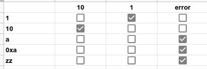
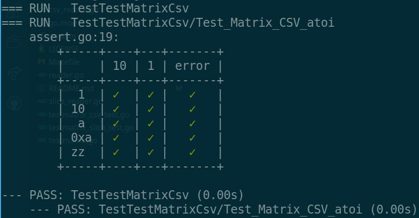

# TestMatrix

Test Matrix is a testing utility to run many test patterns against many
test samples, providing a helpful visual output.

Given an input matrix, which can be generated using a CSV or a slice of slices:



The utility will run tests through all the permutations and provide visual output to help identify patterns in the failures:



The table is printed only with `-v` test flag or with at least one failing test.

## Usage

The matrix of input can be a CSV file, a matrix of type `[][]interface{}` or
a reader that responds to `Read` and `ReadHeaders` functions.

```go
matrix := testmatrix.NewColoredTestMatrix(t *testing.T)

func (matrix testmatrix.TestMatrix) AssertSlice(data [][]interface{}, assert func(subjectText string, headerText string) bool)

func (matrix testmatrix.TestMatrix) AssertCsv(reader io.Reader, assert func(subjectText string, headerText string) bool)

func (matrix testmatrix.TestMatrix) Assert(r testmatrix.Reader, assert func(subjectText string, headerText string) bool)
```

```go
//go:embed atoi.csv
var atoiMatrix string

func TestTestMatrixCsv(t *testing.T) {
  matrix := testmatrix.NewColoredTestMatrix(t)
  reader := strings.NewReader(atoiMatrix)

  matrix.AssertCsv(reader, func(input string, expectedOutput string) bool {
    actualOutput, err := strconv.Atoi(input)

    if expectedOutput == "error" {
      return err != nil
    }

    return strconv.Itoa(actualOutput) == expectedOutput
  })
}
```

The `Assert*` functions have 2 parameters:

An input test matrix (or a reader of such). The test matrix is composed of
expected outputs in the first row and, from the second row and on, the sample
in the first column and if the input function should return or not the expected
output.

The second parameter is a function accepting an input value, the sample from
the first column on the left, and an expected output value: the header at the
top.
The function should output if executing the subject function (`Atoi` in this
case) on the input returns the expected output.

## CSV input

The CSV should be formatted in the following way:

```csv
,expectedOutput1,expectedOutput2
input1,TRUE,FALSE
input2,FALSE,FALSE
```

Where `TRUE` and `FALSE` represent boolean values.

## Slice input

```go
[][]interface{}{
  {"", "10", "1", "error"},
  {"1", "FALSE", "TRUE", "FALSE"},
  {"10", "TRUE", "FALSE", "FALSE"},
  {"a", "FALSE", "FALSE", "TRUE"},
  {"0xa", "FALSE", "FALSE", "TRUE"},
  {"zz", "FALSE", "FALSE", "TRUE"},
}
```
